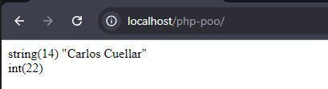

# Breve resumen de PHP

### Constantes

Una constante es un identificador para un solo valor. Y como el nombre lo sugiere este valor no puede cambiar durante el tiempo de ejecución del script (excepto las constantes magicas). Las constantes son case-sensitive. **Por convención los identificadores de constantes son siempre mayusculas**

El nombre de una constante sigue las mismmas reglas de cualquier etiqueta PHP. Un nombre valido de constante puede empezar con una letra o barra baja seguido por cualquier número de letras, npumeros o barras bajas

```php
<?php

// Valid constant names
define("FOO",     "something");
define("FOO2",    "something else");
define("FOO_BAR", "something more");

// Invalid constant names
define("2FOO",    "something");

// This is valid, but should be avoided:
// PHP may one day provide a magical constant
// that will break your script
define("__FOO__", "something");

?>
```

El alcance de las constantes es global. Se puede acceder a las constantes desde cualquier lugar de un script sin tener en cuenta el alcance.

Usando define para definir una constante dentro de una clase, esta no funcionara como se esperam se tiene que usar const e inicializar un valor escalar, booleano, int, float, string (o array en php 5.6.+)

```php
<?php


define('MIN_VALUE', '0.0');   // RIGHT - Works OUTSIDE of a class definition.

define('MAX_VALUE', '1.0');   // RIGHT - Works OUTSIDE of a class definition.


//const MIN_VALUE = 0.0;         RIGHT - Works both INSIDE and OUTSIDE of a class definition.

//const MAX_VALUE = 1.0;         RIGHT - Works both INSIDE and OUTSIDE of a class definition.


class Constants

{

  //define('MIN_VALUE', '0.0');  WRONG - Works OUTSIDE of a class definition.

  //define('MAX_VALUE', '1.0');  WRONG - Works OUTSIDE of a class definition.


  const MIN_VALUE = 0.0;      // RIGHT - Works INSIDE of a class definition.

  const MAX_VALUE = 1.0;      // RIGHT - Works INSIDE of a class definition.


  public static function getMinValue()

  {

    return self::MIN_VALUE;

  }


  public static function getMaxValue()

  {

    return self::MAX_VALUE;

  }

}


?>
```

Puedes acceder a esta constantes directamente:

- Escribiendo el nombre de la clase directamente
- Escribiendo dos punto
- Escribiendo el nombre de la constanten directamente

```php
<?php


#Example 1:

$min = Constants::MIN_VALUE;

$max = Constants::MAX_VALUE;


#Example 2:

$min = Constants::getMinValue();

$max = Constants::getMaxValue();


?>
```

### Programacion Orientada a Objetos con PHP

Revisar la documentacion oficial:
https://www.php.net/manual/es/language.oop5.php

#### Propiedades de una Clase

Tambien se las denomina atributos o campos. Estas se definene utilizando las palabras reservadas **_public, protected, o private_** a partir de php 7.1.0

- A los atributos de una clase declarados como **public** se puede acceder desde donde sea
- A los atributos de una clase declarados como **protected** se puede acceder solo desde la misma clase, mediante clases heredadas o desde la clase padre
- A los atributos de una clase declarados como **private** unicamente se puede acceder desde la clase que los definio

```php
<?php
class MyClass
{
    public $public = 'Public';
    protected $protected = 'Protected';
    private $private = 'Private';
}
```

Dentro de los métodos de la clase se puede acceder a las propiedades no estaticas utilizando -> (el operador del objeto) **$this->$propiedad**. A las propiedades estaticas se puede acceder utilizando **::** **self::$propiedad**

> Nota
>
> > Palabra reservada static
> > Declarar atributos o métodos como **estáticos** los hacen accesibles sin necesidad de instanciar la clase

#### Declaraciones de propiedades tipadas

A partir de php 7.4.0 la definción de propiedades pueden incluirse

```php
class Usuario{
    public string $nombre;
    public int $edad;

    public function __construct(string $nombre, int $edad) {
        $this->nombre = $nombre;
        $this->edad = $edad;
    }
}

$user = new Usuario("Carlos Cuellar", 22);

var_dump($user->nombre);
echo "<br>";
var_dump($user->edad);
echo "<br>";
```

el resultado será:



#### Acceso a las propiedades

```php
class Usuario{
    private string $nombre;
    private int $edad;

    public function __construct(string $nombre, int $edad) {
        $this->nombre = $nombre;
        $this->edad = $edad;
    }

    public function setNombre(string $nombre): void {
        $this->nombre = $nombre;
    }
    public function setEdad(int $edad): void {
        $this->edad = $edad;
    }
    public function getNombre(): string {
        return $this->nombre;
    }
    public function getEdad(): int {
        return $this->edad;
    }
}

$user = new Usuario("Carlos Cuellar", 22);

var_dump($user->getNombre());
echo "<br>";
var_dump($user->getEdad());
echo "<br>";

$user->setNombre("Juan Pablo");
$user->setEdad(66);

var_dump($user->getNombre());
echo "<br>";
var_dump($user->getEdad());
echo "<br>";
```

#### Propiedad Readonly

A partir de PHP 8.1.0, una propiedad se puede declarar con el modificador readonly (de solo lectura), lo que impide la modificación de la propiedad después de la inicialización.

```php
class Test {
   public readonly string $prop;

   public function __construct(string $prop) {
       // Inicialización.
       $this->prop = $prop;
   }
}
```

#### Herencia de Objetos

Es un principio de programación, que nos dice que una clase puede heredar caracteristicas y propiedades de otra clase, esto nos permite implementar funcionalidad adicional a objetos similiare sin reimplementar toda la funcionalidad compartida.

Por ejemplo:

```php
<?php

class Persona{
    private int $id;
    private string $nombre;
    public function __construct(int $id, string $nombre) {
        $this->id = $id;
        $this->nombre = $nombre;
    }

    public function showMessage1(){
        echo "method (showMessage1) Mensaje lanzado desde Persona <br>";
    }

    public function showMessage2(){
        echo "method (showMessage) Mensaje lanzado desde Persona <br>";
    }
}

class Estudiante extends Persona{
    private string $carrera;
    private int $semestre;
    public function __construct(int $id, string $nombre, string $carrera, int $semestre) {
        parent::__construct($id, $nombre);
        $this->carrera = $carrera;
        $this->semestre = $semestre;
    }
    public function showMessage2(){
        echo "method (showMessage2) Mensaje lanzado desde Estudiante <br>";
    }
}


var_dump("Herencias en PHP <br>");

$estudiante = new Estudiante(1, "Rafael", "Informatica", 4);

$estudiante->showMessage1();

$estudiante->showMessage2();
```

#### Compatibilidad del tipo de retorno de clases internas

Antes de php 8., muchas de las clases internas o métodos no se declaraba el tipo de retorno, y ningun tipo de retorno era permitido cuando se heredaba de ellas.

Como PHP 8.1.0, muchos de los métodos internos empezarón a declarar tentativamente su tipo de retorno, en ese caso el valor retornado de los metodos deberia ser compatible con

https://www.php.net/manual/es/language.oop5.inheritance.php
